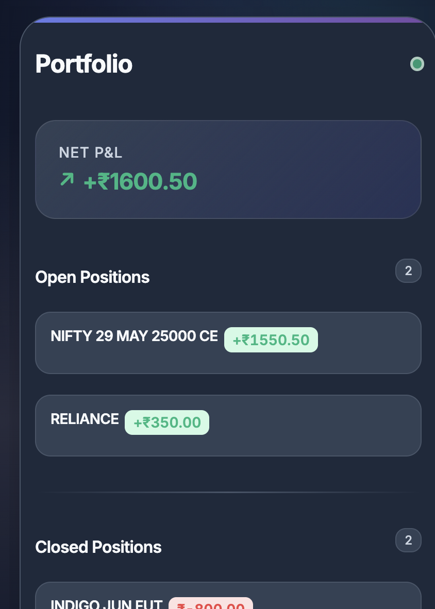

# 🚀 Dhan Portfolio Viewer

[](https://chrome.google.com/webstore/detail/your-extension-id)
[](LICENSE)

> **The best way to view your Dhan trading portfolio, PnL, and positions right from your browser!**

---

## ✨ Features

- 🔥 **Instant Net PnL**: See your real-time net profit & loss for the day
- 📈 **Open & Closed Positions**: Beautifully organized, always up-to-date
- 🛡️ **Privacy-first**: Your token stays on your device
- ⚡ **One-click Reload**: Refresh your data instantly
- 🎨 **Gorgeous UI**: Modern, clean, and responsive design
- 🛠️ **Easy Setup**: Just paste your Dhan access token and go

---

## 📸 Screenshots

| Popup View | Settings |
|---|---|
|  |  |

---

## 🧑‍💻 Installation

### From Chrome Web Store
1. [Install from Chrome Web Store](https://chrome.google.com/webstore/detail/your-extension-id)
2. Click the extension icon and open the popup
3. Go to **Settings** and paste your Dhan access token

### Developer Mode (Local)
1. Clone this repo:
   ```sh
   git clone https://github.com/abhisheksoni27/marketwatch.git
   cd marketwatch
   ```
2. Install dependencies and start the proxy server:
   ```sh
   pnpm install
   pnpm start
   # Proxy runs at http://localhost:3001
   ```
3. In Chrome, go to `chrome://extensions` > Enable **Developer mode**
4. Click **Load unpacked** and select this folder
5. Open the extension popup, go to **Settings**, and paste your Dhan access token

---

## 🌐 Proxy Server Setup (CORS Fix)

Dhan's API does not support CORS for browser extensions. This project includes a simple Node.js proxy server:

- Start it with `pnpm start` (see above)
- The extension will automatically use `http://localhost:3001/positions` for API calls
- **Never share your access token**

---

## 🔒 Security & Privacy
- Your Dhan access token is stored only in your browser (Chrome sync storage)
- All API calls are proxied locally; your data never leaves your machine
- **Open source**: Review the code yourself!

---

## 🤝 Contributing

Pull requests, issues, and feature suggestions are welcome!

1. Fork this repo
2. Create a feature branch
3. Submit a PR

---

## 📄 License

MIT License. See [LICENSE](./LICENSE).

---

> _Made with ❤️ for traders by [Abhishek Soni](https://github.com/abhisheksoni27)_ 